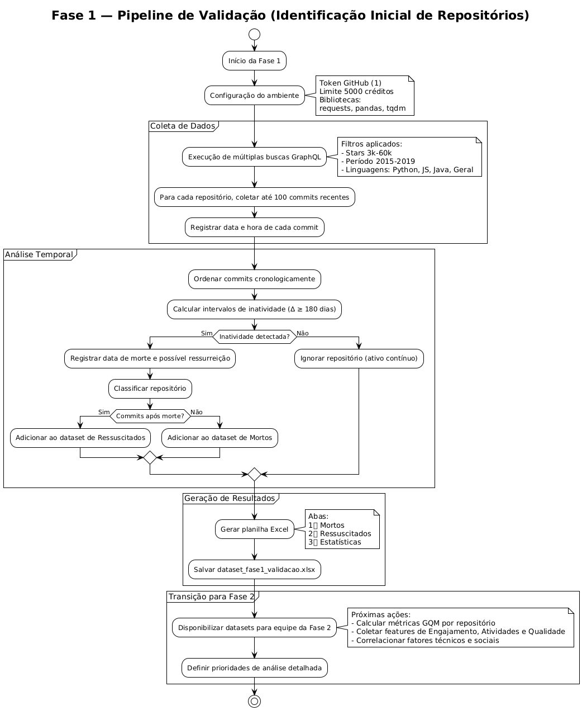

# Validação — Fase 2 (instruções para desenvolvedores)

> Documento de instruções para a **Fase 2** (validação ampliada / coleta de métricas) usando os resultados gerados em **Fase 1 (validação)**.

> Dica: Este arquivo pode ser utilizado como instructions para contextualizar IAs generativas!!

> Use `dataset_fase1_validacao.xlsx` como entrada para fazer o processamento da fase 2.

---

## Resumo curto (o que já temos e o que deve ser feito)

* **O que a Fase 1 entregou:** `dataset_fase1_validacao.xlsx` com 3 abas:

  * **Mortos** — repositórios com inatividade detectada (gap ≥ 180 dias);
  * **Ressuscitados** — repositórios com morte e commits posteriores;
  * **Estatísticas** — resumo da coleta (quantidades, taxas etc.).
* **Objetivo da Fase 2:** para cada repositório selecionado (priorizar os da aba *Ressuscitados*), coletar, processar e analisar os dados necessários para atender os 3 pilares do GQM (Engajamento, Atividades, Qualidade) e preparar um dataset unificado para análise estatística / ML.

---

## Visão geral do pipeline da Fase 2 (passos)

1. **Preparar ambiente**: Trabalhar em uma branch separada, criada a partir da main.
2. **Ingestão** — carregar `dataset_fase1_validacao.xlsx` e selecionar repositórios alvo.
3. **Coleta detalhada** — para cada repo: commits (com paginação), PRs, issues, discussions, arquivos de engajamento (README, CONTRIBUTING, CODE_OF_CONDUCT), releases, contributors.
4. **Qualidade do código** — coletar/rodar análises estáticas (SonarQube / linters / coverage), em snapshots pré-morte e pós-ressurreição.
5. **Processamento textual** — extrair informações de PRs titles/bodies, issue templates, commit messages, comments.
6. **Agregação** — unir todas as informações por repositório (pré/pós morte).
7. **Validação** — checar integridade e gerar relatórios de qualidade dos dados.
8. **Entrega** — dataset unificado (CSV/XLSX) + texto detalhando o que temos.

---

## Sugestão de construção das fases

### 1) Ingestão — como começar

* Abra `dataset_fase1_validacao.xlsx`

  * Priorize **aba `Ressuscitados`** (esses são o foco principal de Fase 2).
  * Se o objetivo for mais amostra, adicione também alguns da aba `Mortos` como controle.

**Colunas esperadas (mínimo):**

* `Nome` (owner/repo)
* `URL`
* `Stargazers`
* `Data de morte` (YYYY-MM-DD)
* `Data de ressurreição` (YYYY-MM-DD or None)
* `Commits analisados` (opcional)

---

### 2) Coleta detalhada — instruções e boas práticas

#### 2.1. Seleção e priorização

* Recomendado: utilizar repos da aba de ressucitados do dataset da fase 1

#### 2.2. Commits (paginação)

* **Por que:** Fase 1 usou `history(first:100)` → pode perder lacunas antigas.
* **O que fazer:** implementar paginação (`history(first:100, after: CURSOR)`) para coletar **até 500 commits** (5 páginas), ou até a criação do repo.
* **Atenção ao rate-limit:** faça backoff exponencial e verifique `X-RateLimit-Remaining`/`X-RateLimit-Reset`. Não dispare paralelismo massivo sem controle.

### 2.3. Pull Requests / Issues / Discussions

* Use GraphQL para PRs & Issues com paginação (`first:100`, depois `after:`). Colete campos relevantes:

  * PR: `title`, `body`, `createdAt`, `mergedAt`, `state`, `comments -> totalCount`, `reviews -> totalCount`, `additions`, `deletions`.
  * Issue: `title`, `body`, `labels`, `createdAt`, `closedAt`, `comments -> nodes`.
  * Discussion (se relevante): título, body, comments.
* Salve raw JSON por repositório para auditoria.

### 2.4. Contributors / authors

* Liste autores únicos: commits → author.user.login / author.email.
* Métrica: número de contribuidores pré/pós morte, novos vs. retornantes.

### 2.5. Arquivos de engajamento

* Baixar conteúdo de `README.md`, `CONTRIBUTING.md`, `CODE_OF_CONDUCT.md`, `ISSUE_TEMPLATE`, `PULL_REQUEST_TEMPLATE`.
* Métricas: presença/ausência, tamanho, data última modificação.

---

## 3) Qualidade do código (processo recomendado)

### 3.1. Snapshots

* Para cada repo ressuscitado: gerar **dois snapshots**:

  * **pré-morte:** commit anterior à `Data de morte` (último commit antes do gap)
  * **pós-revive:** primeiro commit após a `Data de ressurreição`
* Faça checkout desses commits (git clone + git checkout <sha>) em diretórios isolados.

### 3.2. Ferramentas

* **SonarQube** (server local em Docker) + `sonar-scanner` para análise completa (security, reliability, maintainability).
* Complementos: `ESLint` (JS), `flake8`/`pylint` (Python), `radon` (complexity), `bandit` (security).
* **Cobertura de testes:** se o repo tem testes, rodar `pytest`/`npm test` e coletar coverage (se possível). Se não for possível, marcar como NA.

### 3.3. Métricas a coletar (por snapshot)

* maintainability / reliability / security scores (Sonar)
* cyclomatic complexity (avg / max)
* duplication %
* code smells count
* number of vulnerabilities
* coverage % (se aplicável)

---

## 4) Processamento textual

### 4.1. Commit messages

* Features: presença de *conventional commit* format, length, verbs (fix, feat), readability (Flesch), sentiment (opcional).

### 4.2. PR titles/bodies

* Features: title length, body length, presence of template sections, number of reviewers/comments, time-to-merge.

### 4.3. Issues / Comments

* Features: labels usage quality (are labels structured?), avg time-to-close, sentiment (simple polarity), tag coverage.

### 4.4. README/CONTRIBUTING

* Presence of contributing guidelines, contribution steps, code of conduct, setup instructions, CI badges, developer contact.

---

## 5) Agregação — estrutura do dataset unificado

**Formato sugerido (por repositório, por snapshot pré/pós):**

| repo | snapshot | stars | lang | commits_count | contributors_count | commits_interval_mean | pr_count | pr_merge_rate | avg_pr_review_time(days) | issues_count | avg_issue_close_time(days) | readme_present | contributing_present | conventional_commits_rate | complexity_avg | coverage_pct | sonar_maintainability | ... |

* `snapshot` = `pre` / `post` (pré-morte / pós-revive)
* Para métricas de variação: calcule `(post - pre)` e `% change`.

Salve:

* `dataset_features_pre_post.csv` (one row per repo per snapshot)
* `dataset_aggregated_changes.csv` (one row per repo with deltas)

---

## 6) Checks de sanitização de dados

É importante ter essa verificação para que nossa fase de validação faça sentido.

* **Contagem de commits analisados** por repo — garantir que paginação foi aplicada quando necessário.
* **Integridade temporal**: `pre_commit_date <= date_morte < date_revive <= post_commit_date`.
* **Duplicidade**: garantir unicity por `owner/repo + snapshot`.
* **Valores faltantes**: marcar NA, não excluir automaticamente.
* **Logs**: manter um log por repositório com status e erros (ex.: `collected_commits: 350, snapshot_pre_sha: abc...`).

---

## 7) Entrega final (o que deve ficar no repositório)

**Obrigatório:**
* `dataset_fase2_pilar_xxxx.xlsx` — Dataset daquele pilar

_Opcional:_
* `dataset_fase2_pre_pos.csv` — dados por snapshot.
* `dataset_fase2_changes.csv` — deltas entre pre/pos (normalizado).
* `logs/fase2_run_TIMESTAMP.log` — log completo da execução.
* `raw/<owner_repo>/commits.json` / `prs.json` / `issues.json` — raw JSON por repo.

---

## 8) Checklist de qualidade (antes de commitar resultados)

* [ ] Todos os repositórios alvo foram processados (ver `Total coletados`).
* [ ] Commits paginados quando necessário (>=100 commits).
* [ ] Snapshots pre/pos extraídos com sucesso.
* [ ] Sonar / linters rodados nos dois snapshots (quando possível).
* [ ] Todos os dados obrigatórias preenchidas (ou marcadas NA).
* [ ] `dataset_fase2_pilar_xxxx.xlsx` gerado e validado (no mínimo 1 linha por snapshot).
* [ ] Logs e raw JSON salvos.
